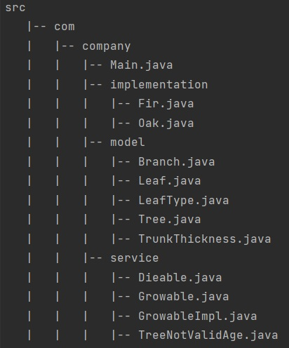

# Tree Growth Cycle

## About :bulb:

It's a simple application written using OOPs concepts in Java.  
The purpose of the application is to simulate the growth of an oak/fir based on the entered data: name, initial age and height.  
[Show me the result](#result)

## Project structure :pencil2:

##  The result  :man_technologist:

